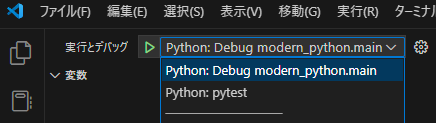

# modern_python_template

VSCode 用の Python プロジェクトテンプレート

- 型チェック: `pyright`
  - `pyright` か `mypy` の 2 択
  - VSCode との相性は `pyright` が良い
- フォーマット: `ruff`
  - 最近は `ruff` の 1 択
  - リントも出来る
- 仮想環境: `venv`
  - `poetry` のほうが良いらしい
  - ふぁが`scoop` + `windows` で開発してるので...

その他の依存関係は `pydantic` くらい

大規模で開発するなら `prettier` の依存を明示的にしたらよいかも (`npm init -y && npm install --save-dev prettier`)

## 使い方

依存関係をインストールしたらここを押すと、デバッガがアタッチされて実行される



## その他の設定

ユーザーの `settings.json` に追加する

```json
{
  "editor.formatOnPaste": true,
  "editor.formatOnSave": true,
  "editor.formatOnType": true,

  "editor.codeActionsOnSave": {
    "source.fixAll": "explicit",
    "source.organizeImports": "explicit"
  }
}
```

## VSCode 以外

```shell
python -m modern_python.main
python -m pytest
pyright

```
